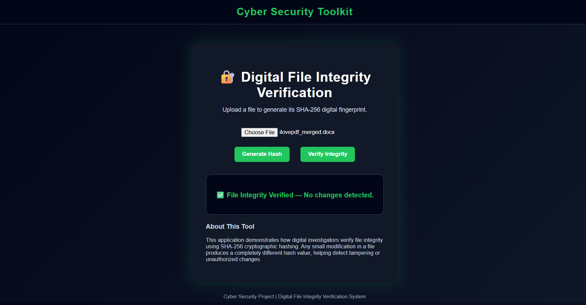

# 🔐 Digital File Integrity Verification System
A cybersecurity web application that verifies file integrity using **SHA-256 cryptographic hashing**.

# 📌 Project Overview
This project demonstrates how digital investigators verify file authenticity using cryptographic hash values. Any small modification in a file produces a completely different hash, helping detect tampering or unauthorized changes.

# 🚀 Features
- Upload any file
- Generate SHA-256 hash fingerprint
- Verify file integrity
- Detect file tampering
- Persistent hash storage using browser Local Storage
- Copy hash functionality
- Professional cybersecurity dashboard UI

# 🛠 Technologies Used
- HTML5
- CSS3
- JavaScript
- Web Crypto API
- Browser Local Storage

# 🔐 Cybersecurity Concepts
- Cryptographic Hashing (SHA-256)
- Data Integrity Verification
- Digital Forensics Workflow
- Evidence Validation
- Tamper Detection

#⚙️ How It Works
1. Upload a file
2. Generate SHA-256 hash
3. Hash is stored as reference
4. Re-upload file for verification
5. System compares hashes to detect modification

---

#▶️ How to Run
1. Download or clone repository
2. Open `index.html` in browser
3. Upload file and generate hash

# 📷 Project Screenshot

# 💼 Resume Value
This project demonstrates practical cybersecurity skills including cryptographic hashing, file integrity verification, and digital forensic validation techniques.

#👩‍💻 Author
MCA Student | Cybersecurity Enthusiast

